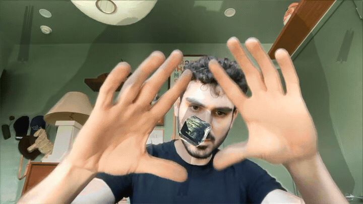

# appletd

**Apple's on-device neural networks in TouchDesigner. Hands, body, face, person
segmentation and metric depth — as CHOP channels and TOPs, with no Python running
in your cook.**

Vision*.framework* and Core ML — the computer-vision APIs that ship in macOS. Not
Vision Pro. Nothing here needs a headset.

<!-- ────────────────────────────────────────────────────────────────────────
     GIFs go here. Drop the files in docs/media/ and delete the comment markers.
     See docs/media/README.md for what each one should show.




     ──────────────────────────────────────────────────────────────────────── -->

---

## Install

```bash
git clone https://github.com/ORG/appletd
cd appletd

python3.11 -m venv ~/.venvs/appletd
~/.venvs/appletd/bin/pip install -r requirements.txt

./tools/fetch_models.sh          # 47 MB, only if you want depth
```

Check it works before involving TouchDesigner — no camera, no TD:

```bash
~/.venvs/appletd/bin/python tools/depth_probe.py
```

The pyobjc wheels are pinned to **cp311** deliberately: TouchDesigner ships Python
3.11, and a pyobjc that disagrees with its ABI is a crash inside TD rather than an
`ImportError`.

> **Status.** This runs on one machine today — fifteen files hardcode an absolute
> path, so a fresh clone will not open yet. The fix is designed
> ([`docs/BUILD_PLAN.md`](docs/BUILD_PLAN.md) step 21) and turns out to be simpler
> than expected: TouchDesigner bundles its own Python 3.11 with pip and numpy, so
> the venv above may disappear in favour of one Install button.

---

## Usage

Open the project, find the **Vision** COMP, and switch `Active` on. That is it —
the COMP launches the sidecar process itself, and the status light goes green.

| parameter | does |
|---|---|
| `Active` | starts and stops the sidecar |
| `Camera` | dropdown, refreshable — picks the device |
| `Restart` | pulse; needed after changing anything the sidecar reads at launch |
| `Streamhands` `Streampose` `Streamface` | one Vision request each |
| `Streamsegment` + `Segquality` | person mask: `fast`, `balanced`, `accurate` |
| `Streamdepth` + `Depthpins` | depth, and the pins that make it metric |
| `Coordstx` `Coordspx` | world-space and pixel-space channel sets |
| `Deleteempty` | trims channels nothing is computing off the output |

Three outputs, because a COMP can carry connectors of different families but
`out1` cannot be both a CHOP and a TOP:

    out1        CHOP   every channel — 258 in the shipping configuration
    outmask     TOP    the person segmentation mask
    outdepth    TOP    the depth map, raw or in metres

### Running it headless

The sidecar is a normal CLI and does not need TouchDesigner at all:

```bash
~/.venvs/appletd/bin/python -m appletd.sidecar --list-cameras
~/.venvs/appletd/bin/python -m appletd.sidecar --streams hands,depth
~/.venvs/appletd/bin/python -m appletd.sidecar --fps 60 --port 10000
```

Channels go out over OSC on UDP loopback — hands on the base port, pose on +1,
face on +2 — and land in TouchDesigner through a stock **OSC In CHOP**. No Script
CHOP, no callbacks DAT, no Python in your cook.

### Driving it with no camera

```bash
~/.venvs/appletd/bin/python tools/send_synthetic.py clap --period 4
```

Synthetic hands over the same encoder and the same port, so TouchDesigner cannot
tell the difference. Useful for building against, and for testing anything with
memory. It refuses to run while the sidecar is up, because both write to the same
port and TD would interleave them into one hand alternating between the two —
which does not look like a fault, it looks like a result.

---

## What you get

```
h0_wrist_x          h0_wrist_y          h0_wrist_conf
h0_index_tip_x      h0_index_tip_y      h0_index_tip_conf
h0_pinch_index      h0_curl_middle      h0_spread
hands_distance      hands_center_x      hands_angle
```

    hands    21 joints × 2, plus pinches, curls, spreads and two-hand geometry
    pose     19 body joints
    face     76 landmarks across 12 regions, plus a bounding box
    mask     person segmentation, three qualities
    depth    Depth Anything V2 Small via Core ML, in metres if you pin it

An absent hand reports **zeros with all of its channels still present**. A CHOP
whose channels appear and disappear breaks every downstream reference the moment
they vanish, and that is a worse failure than a zero because it is silent.

Three coordinate spaces, all computed by stock operators:

| suffix | space | |
|---|---|---|
| `_x` `_y` | normalised, as Vision gives it | |
| `_tx` `_ty` | TouchDesigner world | `(x − 0.5) × Orthowidth`, y by the **render's** aspect |
| `_px` `_py` | pixels | `x × Resw` |

Two-hand attributes like `hands_center` zero out when either hand is missing, so
gate on `hands_count == 2` before using them — after the world transform, a zero
becomes the left edge of frame rather than an obvious absence.

---

## Why it is built this way

Vision is fast. Running it inside TouchDesigner's Python is not:

| where the work runs | Vision call | + landmark conversion | throughput |
|---|---|---|---|
| a separate process | 4.38 ms | — | **30 fps** |
| TD's main thread | 2.09 ms | 5.65 ms | cook-rate bound |
| a TD background thread | **58.90 ms** | **190.83 ms** | **5.2 fps** |

A Python background thread in TD's process is starved **28×**, purely from
reacquiring the GIL after every pyobjc call. Not the camera, not the GPU, not the
cook — each of those was ruled out with its own measurement. Everything else
follows from that table.

The short version of the rest:

- **A sidecar process, not a plugin or a thread.** If it dies, TD keeps rendering
  and a light goes red. Two independent mechanisms stop it outliving TD and
  holding your camera, because a `Popen` child on macOS survives its parent.
- **Landmarks over OSC, images over shared memory.** OSC is right for a few
  hundred floats and wrong for a 406 KB depth map. Images go through a file-backed
  `mmap` with a seqlock: 0.0204 ms per read, and zero torn frames in 56,591.
- **Not TouchDesigner's own shared memory.** It is closed to a foreign writer —
  `UT_SharedMem`'s lock name is 36 characters and macOS's `shm_open` limit is 31.
- **fp16 end to end.** The depth model emits ~7,300 distinct values per frame; an
  8-bit transport would give 256.
- **Metric depth by pinning, not by a metric model.** You name points you have
  measured and it solves `1/Z = alpha·d + beta`. A metric model is confidently
  wrong in a room it was not trained for and nothing in the output says so.
- **Most of it is switched off.** A toggle here means `allowCooking = False` — the
  operators do not run. Everything on is 1.74 ms and 207 cooking operators; hands
  only with the attribute layer down is **0.60 ms and 29 of 287**. `allowCooking`
  raises on anything that is not a COMP, which is why the network is grouped into
  COMPs at all: the grouping *is* the gating mechanism.
- **Not C++**, and two of the three original arguments for it were settled the
  other way by measurement. **Not WebSocket**, because TCP head-of-line blocking is
  the wrong trade for data that is worthless when late, and TD's WebSocket DAT puts
  Python back in your cook.

Full argument, including the things that were ruled out and the two decisions that
reversed: [**`docs/ARCHITECTURE.md`**](docs/ARCHITECTURE.md).

---

## Benchmarks

M4 Pro, 12-core, 48 GB, macOS 26.5. Every inference figure depends on the Neural
Engine — an M1, or a Core ML fallback to CPU, will not reproduce these.

| request | per frame | output |
|---|---|---|
| hands | **3.41 ms** | 21 joints × 2 |
| segmentation `fast` | 2.21 ms | 256 × 192, hard alpha |
| segmentation `balanced` | 8.54 ms | 512 × 384, feathered |
| segmentation `accurate` | 30.73 ms | 2016 × 1512 |
| depth, Depth Anything V2 Small | **23.00 ms** | 518 × 392 fp16 |

A 30 fps frame is 33.3 ms. Depth alone is 69% of it; depth plus `accurate`
segmentation is 162% and cannot work. Requests run cheapest-first on one queue, so
what gets dropped is dropped from the end.

The COMP itself:

| configuration | cook | operators cooking |
|---|---|---|
| three streams, everything on | 1.74 ms | 207 / 287 |
| hands only, attribute layer off | **0.60 ms** | **29 / 287** |

Method, caveats and every other figure: [`docs/BENCHMARKS.md`](docs/BENCHMARKS.md).
Comparisons against MediaPipe and the alternative transports are **projections,
not measurements**, and are labelled as such in
[`docs/ARCHITECTURE.md` §7](docs/ARCHITECTURE.md).

---

## The build pipeline

The TouchDesigner network is not hand-built. Eighteen scripts generate it, which is
the only reason a change across 287 operators is reviewable.

```
tools/td_build_vision.py      the master COMP, parameters, the sidecar launcher
tools/td_add_filter.py        one-euro smoothing per stream
tools/td_add_derive.py        the attribute layer (a Script CHOP)
tools/td_add_temporal.py      velocity, presence, debounce
tools/td_add_latches.py       Schmitt triggers with real hysteresis
tools/td_add_coords.py        world and pixel space, from stock operators
tools/td_add_segmentation.py  Script TOP → Fit → outmask
tools/td_add_depth.py         Script TOP → Fit → outdepth, with the pin overlay
tools/td_add_groups.py        gating, and the trim in front of the output
```

They run in dependency order; `tools/td_rebuild.py` runs only the ones a change
actually needs. Every builder **verifies what it built and prints what it found**,
which has caught more bugs than the test suite — including a COMP output silently
falling from 495 channels to 57 while the builder reported success.

## Testing

**539 tests, 17 seconds, no camera and no TouchDesigner.**

```bash
~/.venvs/appletd/bin/python -m pytest -q
```

The split that makes that possible is deliberate: modules that touch Apple
frameworks are kept apart from modules that do arithmetic, and the arithmetic is
where the tests live. `pins.py` imports numpy and nothing else, so it can be tested
against a synthetic frame whose true answer is known — it recovers both parameters
to 1e-6. `maskbuf.py` is stdlib only, so the tearing test can fork a real second
process instead of sharing an address space and proving nothing. `spaces.py` runs a
self-check **at import**, so a pattern that has drifted from the channel contract
fails immediately rather than against a live network an hour later.

---

## Repo layout

```
appletd/          the package — 27 modules, ~9,900 lines
  sidecar.py          the process: camera → Vision → OSC + shared memory
  engine.py           one serial queue, requests cheapest-first
  derive.py           the attribute layer — curls, pinches, spreads
  spaces.py           the coordinate contract, with an import-time self-check
  maskbuf.py          the seqlock transport
  pins.py             the affine depth solve
  tests/              28 files, 539 tests
tools/                18 builders and probes, ~13,800 lines
docs/ARCHITECTURE.md  why it is built this way, at length
docs/BENCHMARKS.md    every figure, and how it was taken
docs/BUILD_PLAN.md    the implementation recipe, step by step
docs/JOURNAL.md       dated entries: what broke, what it cost, what fixed it
docs/STANDARDS.md     the honesty rules the rest of the docs are held to
design/DESIGN.md      the design plan, with the raw measurements
```

Roughly as much prose as code, on purpose. The journal is the part worth copying:
every entry names the defect, the measurement that found it, and the thing it was
mistaken for first.

---

## Known limitations

- **macOS only**, Apple Silicon in practice.
- **No z per joint.** Vision's hand request is 2D plus confidence. Depth fills that
  at frame level, not per joint, and only if you pin it.
- **No tracking IDs.** Vision returns hands in arbitrary order; slots are assigned
  by chirality then wrist proximity, which is not a tracker.
- **Depth and `accurate` segmentation cannot both hold 30 fps.**
- **Depth's metric claim is unverified against a real room.** The solve is tested
  against synthetic frames whose true relationship is known; three tape-measured
  points on stationary geometry is the check that needs a human with a tape measure.
- **No live-camera timings are quoted anywhere.** They track what is in shot, and
  the same configuration measured an 8× spread.

---

> Two numbers that both look measured is worse than one that is wrong, because
> there is no way to tell which is which.
>
> — `docs/STANDARDS.md`
